# Build Log

## The Frame

Mostly according to the documentation. Instead of Misumi profiles I used ITEM profiles and ITEM standard fasteners. Mostly works without problems, but some parts need minor modifications.

All screws are secured with Loctite Medium.

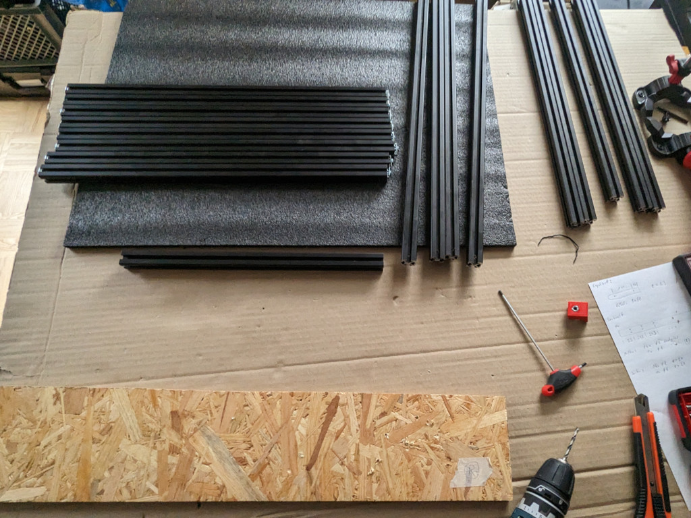
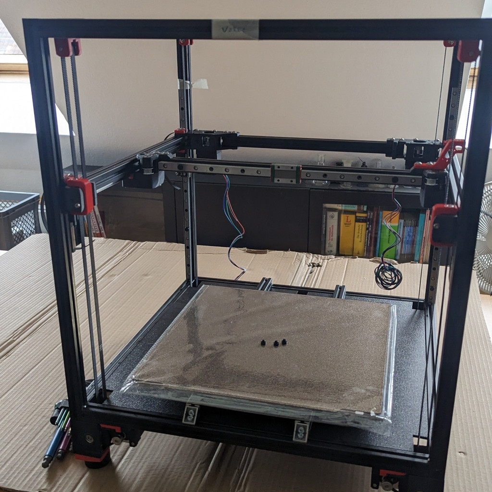

## The Feet

The four feet in the corners with steppers. All parts are printed with black or red ASA.

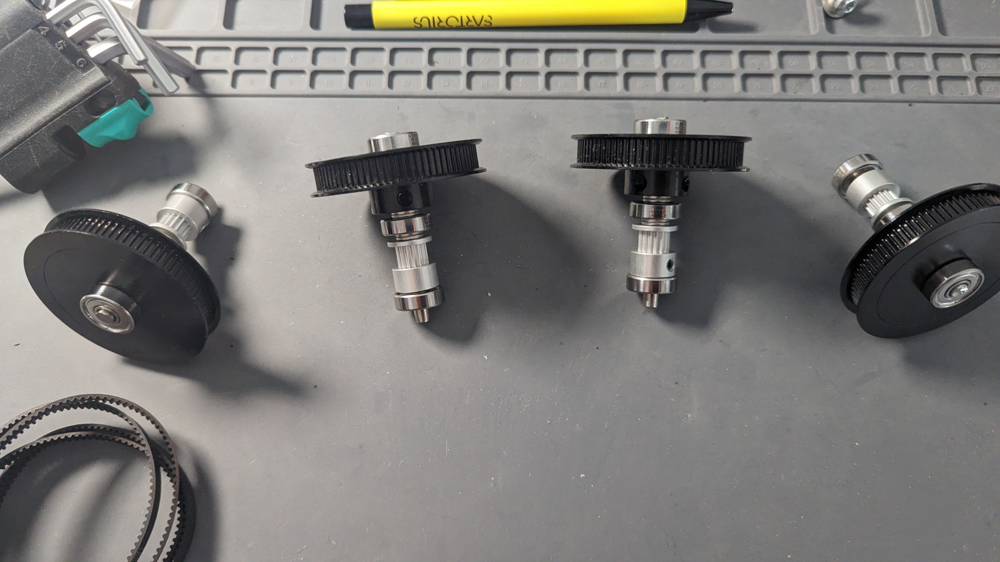
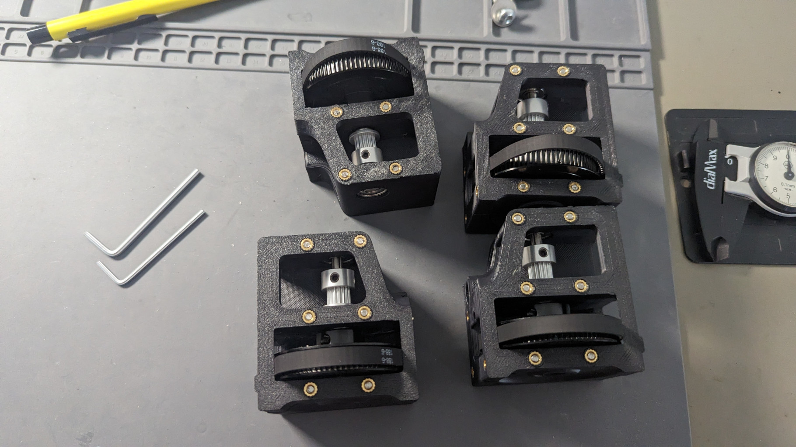
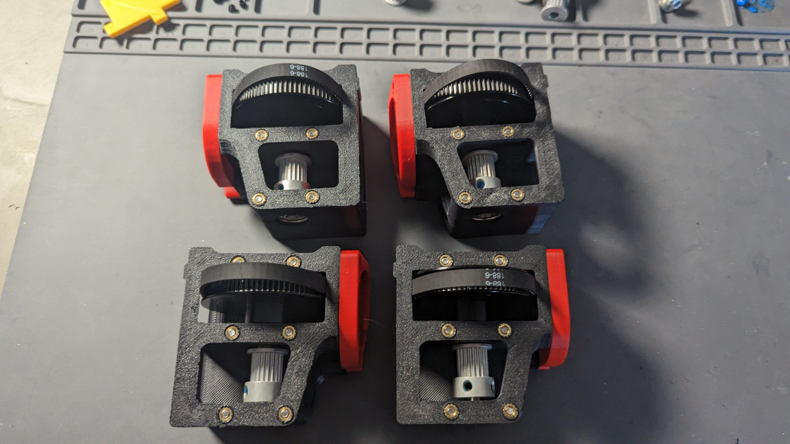

## Controllers

View from the bottom with the wiring and controller boards.
The Octopus Pro can power the Raspberry Pi directly, no need for an additional 5V PSU.
I also have the Raspi connected twice to the Controller, with USB as well as serial.

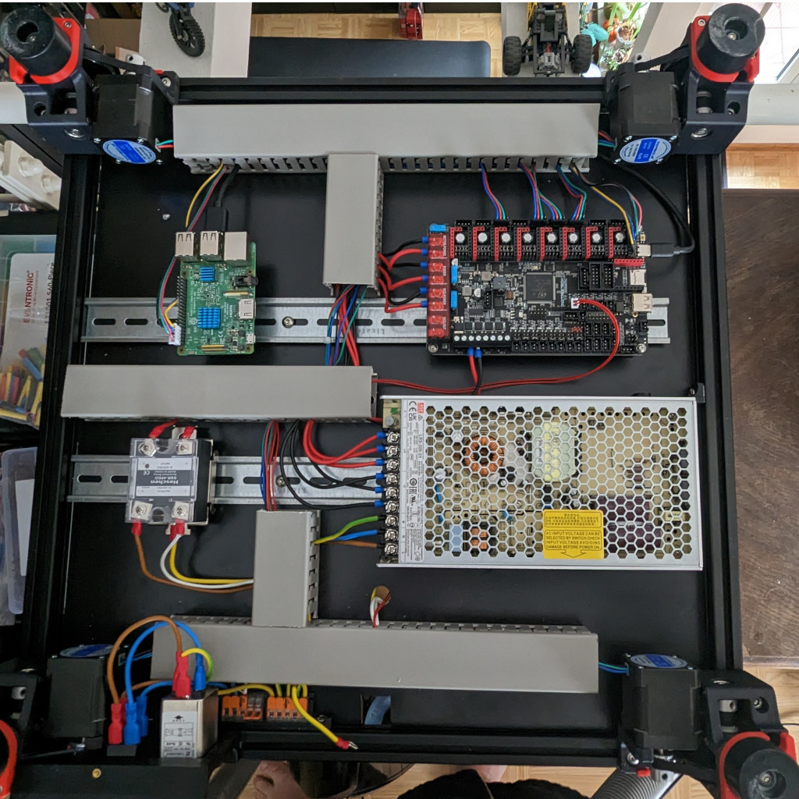

Final (maybe) wiring. Including front display, the shelly for auto-off, fans and so on.

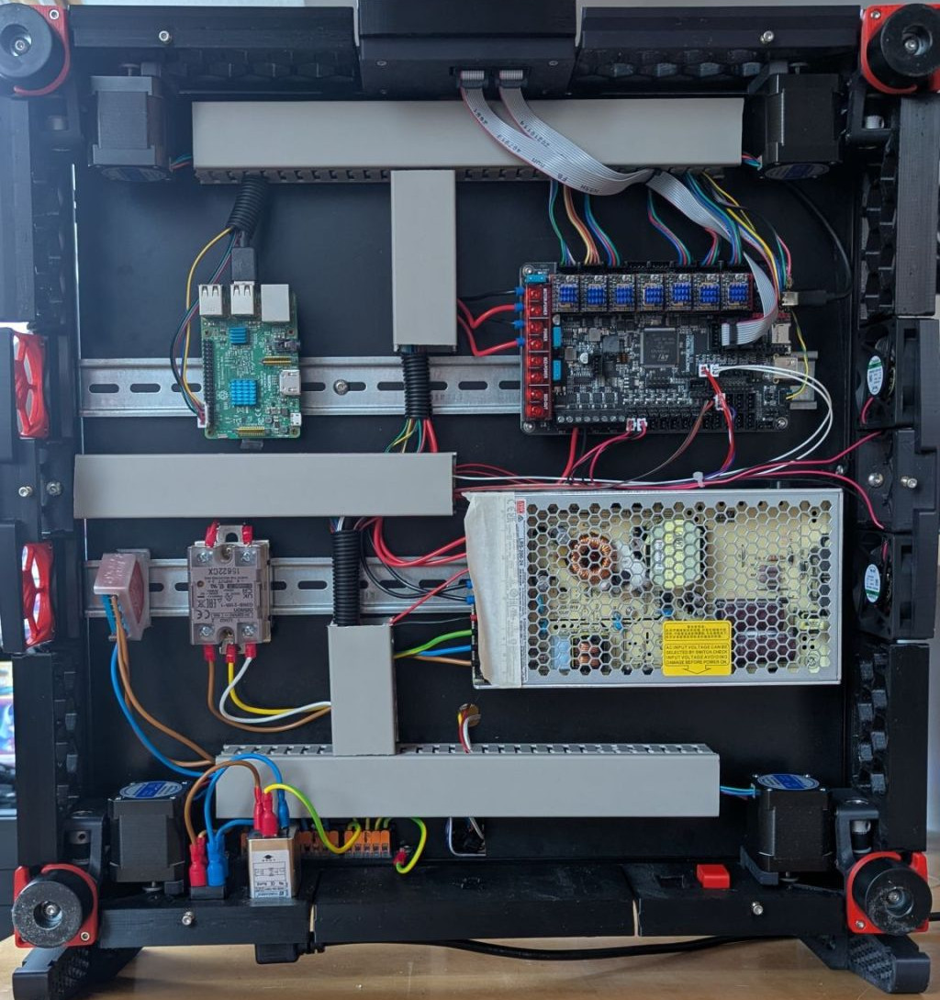

## Stealthburner

The Stealtburner with the 2 PCBs of the CAN board. The main PCB with controller and stepper driver in the extruder, another PCB with fan connectors in the front. The eddy probe will be connected to the front too.

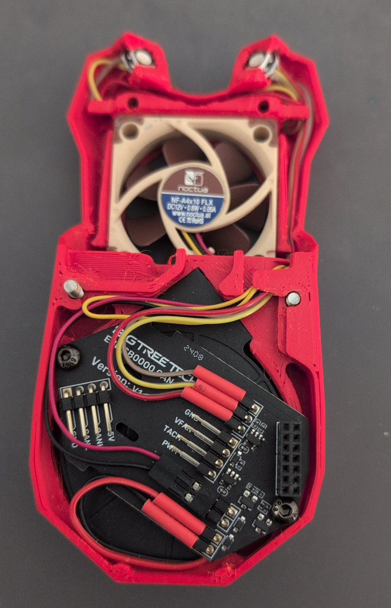
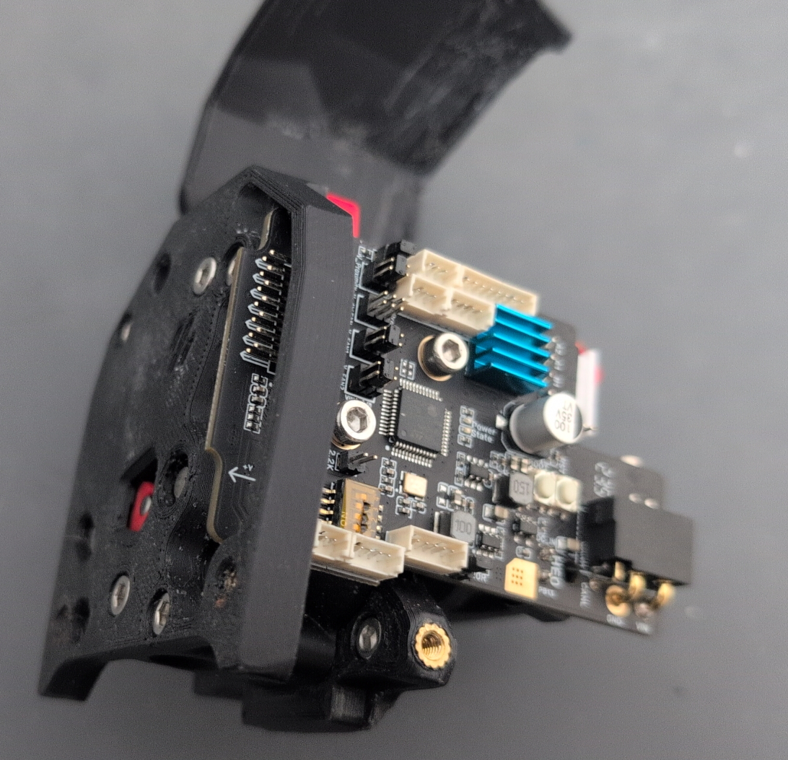

### Voron TAP

The voron tap CNC, replacing the printed carriage.

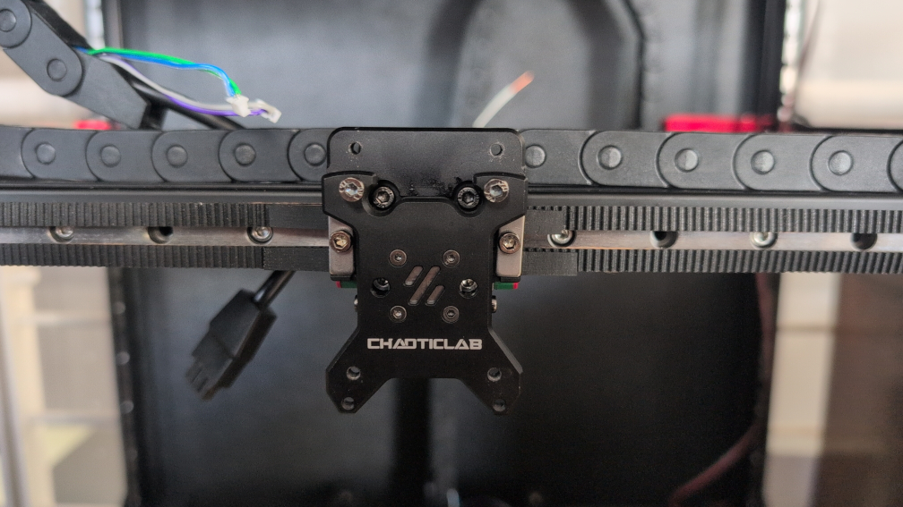

### Eddy Probe

Normally the eddy probe replaces the inductive probe in the carriage, but with the voron tap there is no room for that anymore. So it is placed at the side of the hotend. 

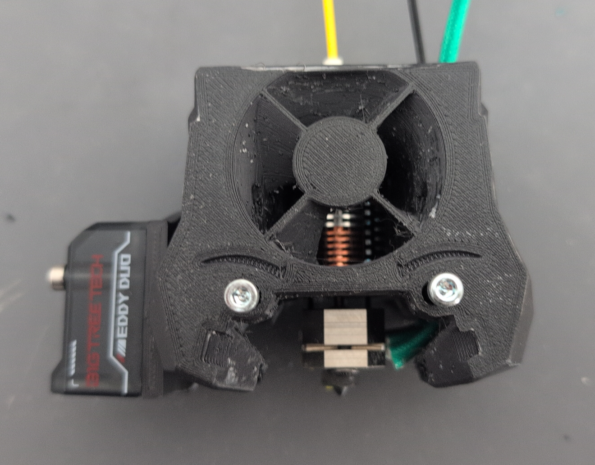

