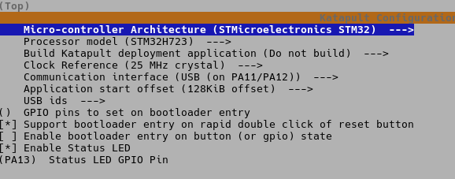
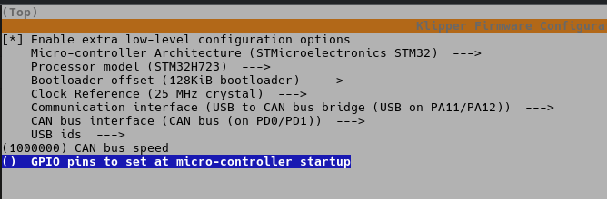

# Controller Board

Bigtreetech Octopus Pro v1.1 (XH2.54 CAN-Stecker)

CPU: STM32H723

- [Manual](https://github.com/bigtreetech/BIGTREETECH-OCTOPUS-Pro/blob/master/BTT_Octopus_pro_EN.pdf)
-g [Klipper Info](https://github.com/bigtreetech/BIGTREETECH-OCTOPUS-V1.0/blob/master/Firmware/Klipper/README.md)
- [Pins](https://github.com/bigtreetech/BIGTREETECH-OCTOPUS-Pro/blob/master/Hardware/BIGTREETECH-Octopus-Pro-V1.0-Color-PIN-V3.0.pdf)
- [Schematic](https://github.com/bigtreetech/BIGTREETECH-OCTOPUS-Pro/blob/master/Hardware/BIGTREETECH%20Octopus%20Pro_SCH.pdf)

| Connector     |                 |                                                       |
| ------------- | --------------- | ----------------------------------------------------- |
| HE1           | SSR             |                                                       |
| Power Motor   | 24V             |                                                       |
| Power         | 24V             |                                                       |
| MOTOR0        | Stepper X/B     | Main power, UART Mode                                 |
| MOTOR1        | Stepper Y/A     | Main power, UART Mode                                 |
| MOTOR2_1      | Stepper Z0      | Main power, UART Mode                                 |
| MOTOR3        | Stepper Z1      | Main power, UART Mode                                 |
| MOTOR4        | Stepper Z2      | Main power, UART Mode                                 |
| MOTOR5        | Stepper Z3      | Main power, UART Mode                                 |
| TB            | Heatbed         |                                                       |
| T0            | Thermistor Case |                                                       |
| STOP_1 (PG9)  | Z-Endstop       | Pull-up enabled                                       |
| STOP_4 (PG12) | Filament Sensor | Inverted                                              |
| FAN0          | Case 1          | 24V                                                   |
| FAN1          | Case 2          | 24V                                                   |
| FAN2          | Exhaust         | 24V                                                   |
| EXP1, EXP2    | Display         |                                                       |
| RGB LED       |                 | Wiring: red: 5V green: PB10 black: GND       |

## Firmware

I flashed the board with the katapult bootloader and a suitable firmware. Nothing special, exactly as described in the wiki

Settings for Katapult:

Settings for Klipper:

