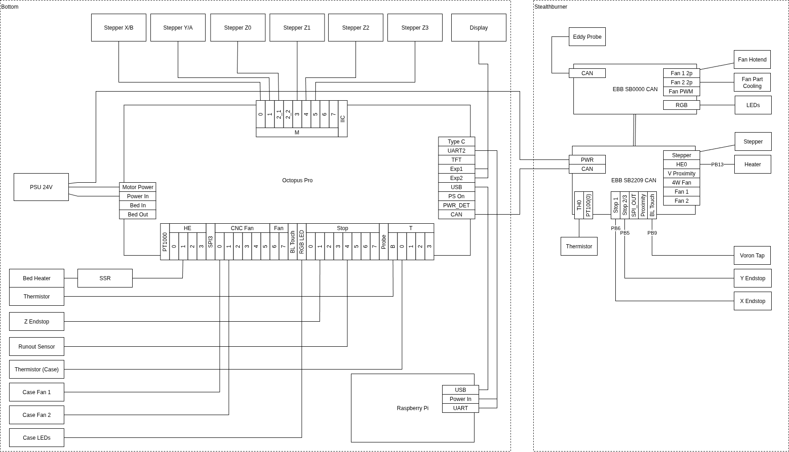

# Voron

Technical documentation, all sorts of stuff, [Build-Log](BuildLog.md) and config for my Voron 2.4

## Components

- Raspberry Pi 3b
- [Controller-Board](Controller.md): [Octopus Pro v1.1](https://biqu.equipment/products/bigtreetech-octopus-pro-v1-0-chip-f446)
- Hotend: ~~[Phaetus Dragon HF](https://www.phaetus.com/products/dragon-hotend-hf)~~ [E3D V6](https://de.aliexpress.com/item/1005007673339236.html)
- [Steppers](Steppers.md)
- [Sensors](Sensors.md)

## Modifications to the Default Voron

- Additional Thermistor to measure the case temperature
- Stealthburner CAN: [EBB SB2240 CAN](https://biqu.equipment/products/bigtreetech-ebb-sb2209-can-v1-0?variant=40214282731618)
- Shelly Plus 1PM Switch between Power Switch and PSU for Auto-Shutdown via Home Assistant
- [RocknRoll](https://github.com/VoronDesign/VoronUsers/tree/main/printer_mods/RockNLol/RockNRoll)
- [Voron Tap CNC](https://www.chaoticlab.com/products/cnc-voron-tap?variant=40494842675298)
- [Triangle Labs Filament Sensor](https://www.trianglelab.net/products/sensors?VariantsId=10607)
- [BTT Eddy Probe](https://biqu.equipment/products/bigtreetech-eddy)
- [Nozzle Brush with Bucket](https://www.printables.com/model/201999-nozzle-scrubber-with-a-little-bucket-for-voron-24?lang=de)
- [Panel Latches](https://github.com/richardjm/voron-parts/tree/main/voron-2.4/FilamentLatch)
- [AngryCam](https://mods.vorondesign.com/details/RYpQW53mtem8Nj1JKqiSQ) (Primary Cam)
- [CamHolder](https://www.printables.com/model/673803-5mp-cam-usb-for-76-degree-auto-fixed-focus-usb-cam) (Secondary Cam)
- [PEI Stop](https://mods.vorondesign.com/details/HPcfxCUYAw8jwTTRJOf9IA)
- [Display Mount](https://www.printables.com/model/926845-btt-hdmi5-v12-display-mount-voron) with 5" Touch-Panel

## Wiring

## Configs

- [Crowsnest](configs/crowsnest.conf): The settings for the two USB cameras.
- [KAMP](configs/KAMP_Settings.cfg): Adaptive meshing and line purging.
- [Macros](configs/macros.cfg): All my macros for Auto-Power-Off, Start/Stop/Pause and homing.
- [Moonraker](configs/moonraker.conf): Moonrakers settings, mostly the update manager links.
- [Printer](configs/printer.cfg): All the Voron settings, including the disabled eddy probe.
- [Telegram](configs/telegram.conf): For the Telegram Bot. Bust the basics at the moment.

## Notes

- With the Octopus Pro board a 5V PSU is not necessary
- X and Y endstops are connected to the CAN-Board in the Stealthburner
- The driver for Z1 had problems, so it is connected do a different driver
- The Raspberry is connected with UART and USB to the Octopus, but ~~only USB is used~~ communication uses CAN

## External Links

Some external and maybe helpful links:

- [I wish I had known](https://docs.vorondesign.com/community/howto/simonthecat/I_wish_I_had_known.html)
- [Build Videos](https://www.youtube.com/playlist?list=PL7zrGeKp_8CTDOmpwZr5JnCSJqEghFh9j)
- [Build and Sourcing Tips](https://www.youtube.com/playlist?list=PL7zrGeKp_8CR7oSREn46GCAteJdN9XGzW)
- [Voron Wiring](https://docs.vorondesign.com/build/electrical/v2_octopus_wiring.html)

## TODO

- [ ] [Balljoint Passthrough](https://github.com/bwilliams9611/ERCF_BallJoint_Passthrough)
- [ ] SW control of the exhaust fan
- [ ] SW control of the case fans
- [ ] Emergency Off
- [ ] Nevermore Filter / [Nevermore Micro](https://github.com/nevermore3d/Nevermore_Micro)
- [ ] [Clicky Clacky Door](https://github.com/tanaes/whopping_Voron_mods/blob/main/clickyclacky_door%2FREADME.md)
- [ ] Kinematic Mounts
- [ ] Beefy Front Idlers
- [ ] [Knomi 2 Remote Control](https://www.printables.com/model/789391-watchmi-the-knomi-2-remote-controller-for-klipper)
- [ ] [HULA Feet](https://github.com/thrutheframe/HULA_Voron)
- [ ] [FilamATrix](https://github.com/thunderkeys/FilamAtrix)
- [ ] [Pika Filament Buffer](https://github.com/geoffrey-young/pika-filament-buffer/tree/main)
- [ ] [ERCF Multi Material](ERCF.md)
