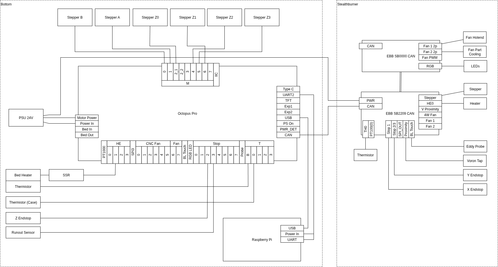

# Voron

Stuff, [Build-Log](BuildLog.md) and Config for my Voron 2.4

## Components

- Raspberry Pi 3b
- Mainboard: [Octopus Pro v1.1](https://biqu.equipment/products/bigtreetech-octopus-pro-v1-0-chip-f446)
- Hotend: [Phaetus Dragon HF](https://www.phaetus.com/products/dragon-hotend-hf)

## Modifications to the Default Voron

- Additional Thermistor to measure the case temperature
- Stealthburner CAN: [EBB SB2240 CAN](https://biqu.equipment/products/bigtreetech-ebb-sb2209-can-v1-0?variant=40214282731618)
- Shelly Plus 1PM Switch between Power Switch and PSU for Auto-Shutdown via Home Assistant
- [RocknRoll](https://github.com/VoronDesign/VoronUsers/tree/main/printer_mods/RockNLol/RockNRoll)
- [Voron Tap CNC](https://www.chaoticlab.com/products/cnc-voron-tap?variant=40494842675298)
- [Triangle Labs Filament Sensor](https://www.trianglelab.net/products/sensors?VariantsId=10607)
- [BTT Eddy Probe](https://biqu.equipment/products/bigtreetech-eddy)
- [Nozzle Brush mit Bucket](https://www.printables.com/model/201999-nozzle-scrubber-with-a-little-bucket-for-voron-24?lang=de)
- [RocknRoll](https://github.com/VoronDesign/VoronUsers/tree/main/printer_mods/RockNLol/RockNRoll)
- [Panel Latches](https://github.com/richardjm/voron-parts/tree/main/voron-2.4/FilamentLatch)

## Wiring

## Notes

- With the Octopus Pro board a 5V PSU is not necessary
- X and Y endstops are connected to the CAN-Board in the Stealthburner
- The driver for Z1 had problems, so it is connected do a different driver
- The Raspberry is connected with UART and USB to the Octopus, but only USB is used

## TODO

- SW control of the exhaust fan
- SW control of the case fans
- Telegram bot
- Another Camera
- LED lighting
- Nevermore Filter
- Clicky Clacky Door
- Kinematic Mounts
