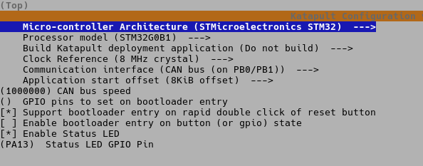
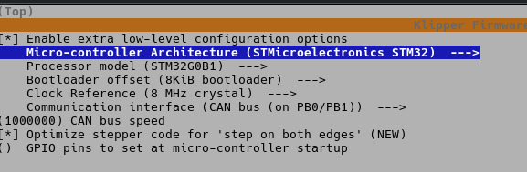

# Stealthburner

## Hardware (Controller)

### Bigtreetech EBB SB2240_2209 CAN V1.0

[Wiki](https://bttwiki.com/EBB%202240%202209%20CAN.html)
[Github](https://github.com/bigtreetech/EBB/tree/master/EBB%20SB2240_2209%20CAN)

- Both Fans pinned to 12V
- ~~Proximity Switch:~~
  - ~~Huchoo TL-Q5MC2-Z (3-Wire, NPN)~~
  - ~~Gepinnt auf aut NPN 12V~~
- Voron Tap CNC
  - Pinned to BL-Touch Connector
- ~~Endstop X (Gantry):~~
  - ~~Pinned to Endstop Connector 3 (PB6)~~
  - ~~Colors Green/Blue~~
- Endstop X (Voron Tap):
  - Pinned to Endstop Connector 3-poled (PB6)
  - Colors black/white
- Endstop Y:
  - Pinned to Endstop Connector 4-poled Stop 2 (PB5)
  - Colors grey/violett
- ~~[Eddy Probe](https://bttwiki.com/en/Eddy.html):~~
  - ~~STL~~
    - ~~<https://www.printables.com/model/1154427-chaoticlab-voron-tap-v2-btt-eddy-mount/files>~~
    - ~~<https://www.printables.com/model/1095206-chaoticlab-voron-tap-v2-btt-eddy-mount>~~

## Software

[Documentation](https://global.bttwiki.com/EBB%202240%202209%20CAN.html#software-configuration)

Settings for Katapult Bootloader

Settings for Klipper with CAN-USB

## Hardware (Hotend)

E3D V6 Hotend

## Hardware (Extruder)

Original Stealthburner
